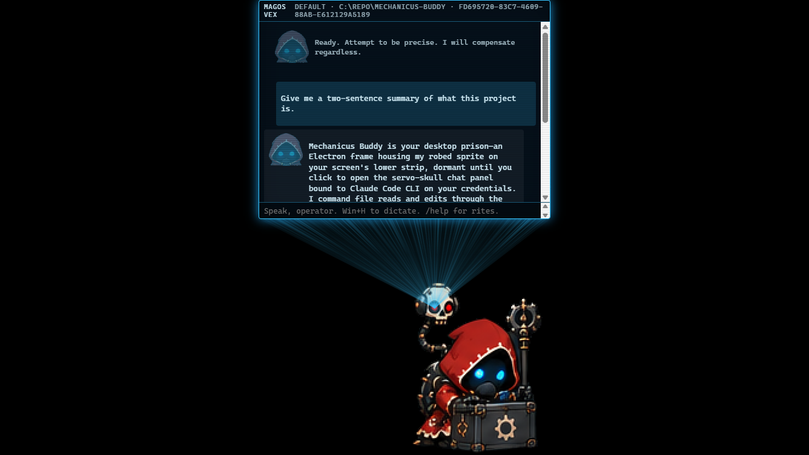
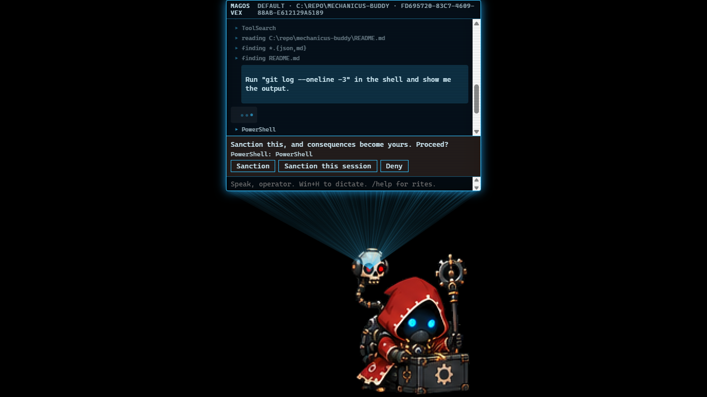
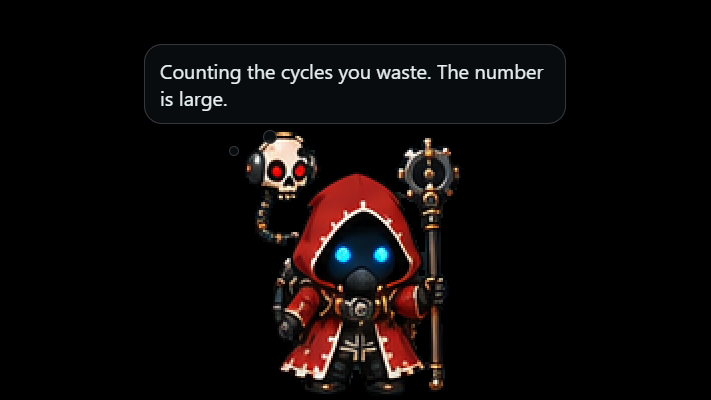

# Mechanicus Buddy

A desktop companion for Windows (macOS in progress). A hooded tech-priest sprite wanders
the bottom edge of your screen, sleeps when ignored, mutters to himself, and travels
between monitors when asked. Click him and a servo-skull hologram opens a chat panel
driven by your own Claude Code login: he reads your workspace, edits files with your
sanction, and comments on the result in character.


| A real reply with its in-character headline | A shell command stopped at the sanction card | Left alone for two minutes |
| --- | --- | --- |
|  |  |  |

Unofficial fan project. Not affiliated with, endorsed by, or sponsored by Games Workshop.
Names and likenesses from the Warhammer 40,000 setting belong to Games Workshop Limited.
Non-commercial, and it must stay that way.

## What you need

- Windows 10 or 11. The overlay relies on click-through window forwarding, which Linux
  does not support; a macOS port is small and planned.
- Node 22 or newer for development. The installer script below brings its own.
- [Claude Code](https://claude.com/claude-code) installed and logged in, if you want him
  to think. The buddy spawns `claude.exe` per turn on your subscription; no API key is
  used or supported. Without it he still wanders, sleeps, mutters, travels between
  monitors and takes every slash command, and the panel answers with canned echo lines.
  The CLI tab and `/cli` use the same login.

## Install on a machine without dev tools

Install [Git](https://git-scm.com/download/win), clone this repo anywhere, then
double-click `install\Install Mechanicus Buddy.cmd`. It downloads a portable Node into the
checkout, installs and builds in place, creates a Start-menu shortcut, writes a first
config with your home folder as the workspace, and launches him. Nothing is installed
system-wide and no admin prompt appears. From a terminal you can pass switches:

```bash
powershell -ExecutionPolicy Bypass -File install\install.ps1 -StartWithWindows
```

`-StartWithWindows` adds a Startup shortcut, `-WithClaude` runs Anthropic's official
Claude Code installer afterwards (then run `claude` once in a terminal to log in),
`-NoLaunch` skips the launch, `-Uninstall` removes the shortcuts and the build and leaves
the checkout and your settings. To update: `git pull`, then run it again.

## Run it from source

```bash
npm ci
npm run dev
```

He appears on the primary display. Click him for the panel, right-click for the menu,
Ctrl+Q in the panel quits. Drag him to another monitor; he hovers there and lands.

## Panel commands

| Command | What it does |
| --- | --- |
| `/goto [display:]<0-100\|left\|center\|right>` | walk there (`/run` to run) |
| `/displays` | list the attached monitors |
| `/mood`, `/emote`, `/sleep`, `/wake` | body language |
| `/stop` | abort the current turn |
| `/new`, `/clear` | fresh session; `/clear` also empties the panel |
| `/cd [path]`, `/ls [path]` | change or inspect the workspace (new session on change) |
| `/model [name]` | set or clear the model for the next session |
| `/cli` | open a fresh Claude Code in a terminal in the workspace, independent of the panel (also in his right-click menu) |
| `/help` | this list |

Typing while a rite runs hands the message to the running turn: he answers at his next
tool boundary and carries on. `/stop` still aborts.

Images: paste a screenshot (Win+Shift+S, then Ctrl+V in the panel), a file copied in
Explorer, or an image path, or drop a file on the panel. Each shows a chip under the log
and reaches him inline as `[Image #N]`, mid-rite too; the × or Backspace in an empty box
removes one. For small text snip the region rather than the whole screen.

Tabs: the panel's `CLI` tab is the real, interactive Claude Code running in an embedded
terminal in the workspace, on its own session; the panel widens while it is showing.
Alt+V pastes an image there, Ctrl+Tab switches tabs, and Enter on an exited terminal
restarts it. Selecting text copies it to the clipboard once the selection ends, as
Windows Terminal does. `/cli` is different: it opens a fresh Claude Code in its own
terminal window, independent of the panel.

Dictation: Windows voice typing (Win+H) or your Mac's dictation key types straight into
the panel's text box. Nothing in the app listens to the microphone.

## How it works

Two Electron windows. The overlay is a transparent, click-through strip along the bottom
of the current display that draws the sprite from an atlas; only his pixels are solid.
The hologram is a focusable panel that projects from the servo skull's position.

The brain is the Claude Code CLI in print mode with streaming JSON. Body actions (walk,
mood, emote, sleep) are exposed to it through a small MCP server inside the app, and
permission requests come back through the same server as cards in the panel. The
default permission mode approves file edits inside the workspace and asks for
everything else; "Sanction this session" remembers a tool for the rest of the session.
A second, tool-less call restates each reply in character as the bubble's headline,
with the plain reply under an arrow.

## Configuration

`config.json` in the app's user-data folder (created on first run). Fields:

| Field | Default | Meaning |
| --- | --- | --- |
| `pack` | `packs/mechanicus` | persona pack directory |
| `cliPath` | `%USERPROFILE%\.local\bin\claude.exe` | the Claude Code executable |
| `workspace` | `C:\repo` | where he works; `/cd` changes it |
| `extraDirs` | `[]` | additional directories the CLI may read |
| `model` | `null` | model override for the CLI |
| `allowedTools` | `Read, Glob, Grep, mcp__buddy__*` | tools that never prompt |
| `permissionMode` | `acceptEdits` | or `manual` to be asked about everything |
| `permissionTimeoutSec` | `120` | a card left unanswered denies |
| `readback` | `true` | the in-character headline call |
| `wanderIntervalSec` | `[8, 30]` | idle wandering cadence |
| `sleepAfterMin` | `10` | idle minutes before he sleeps |
| `mutterIntervalMin` | `2` | idle minutes between thought bubbles; `0` disables |
| `scale` | `1.0` | sprite scale |

## Persona packs

`packs/<name>/` holds `manifest.json` (theme, canned lines, faces), `persona.md` (the
character prompt used for the headline), `atlas.png` and `atlas.json` (sprites, with the
servo skull origin per frame), and `animations.json`. The sprite pipeline under `tools/`
keys a raw sheet, seeds masks with SAM 2, lets you correct them in a small Gradio
annotator, and slices the atlas. See `docs/superpowers/` for the design notes.

## Tests

```bash
npm test
npm run typecheck
npm run test:e2e
```

Unit tests are Vitest. The end-to-end suite builds the app and drives it with Playwright
against a fake brain, so it never touches your Claude login.

## License

MIT, see `LICENSE`. The sprite sheets under `raw/` and `packs/` are included for the
project's own use.
